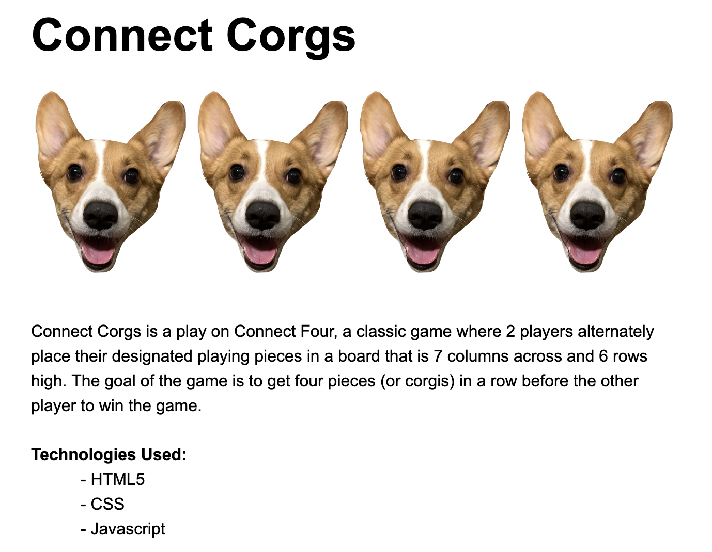
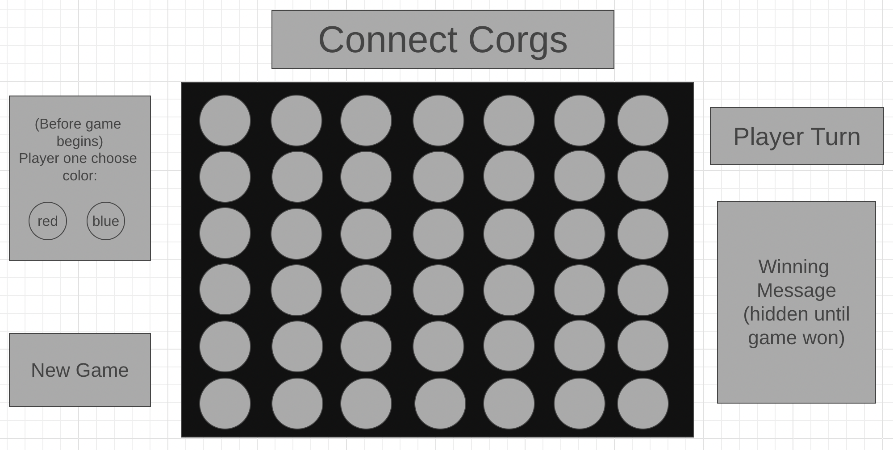

# Connect-Corgs
Overview:

Wireframe:

User Story:

As a user, I want the ability to:

    - Visit connect-corgs site
    - Read instructions of game
    - Choose color of player
    - Drop specific color assigned to that player in preffered spot on game board
    - Continously alternate with other player until there is a tie or one player wins
    - See messages on screen depicting either a tie or a win including which player won
    - Have the option of playing again without refreshing the screen

Entitiy Relationship Diagram:

    - On page load, modal appears with game instructions
    - player1 = X
    - player2 = O
        - color decided on which player 1 chooses before game begins
        - add class to each player depending on what color chosen
    - checkWinArr: array including all possible winning combinations
    - restart button

    - functions:
        - playerMove(): adds token to collumn player chose (on top of current tokens if present)
        -checkWin(): check current tokens played against checkWinArr
            - if there is a win, message diaplyed to tell users which player won
            -if the board is filled with no player having 4 in a row, display message that it is a tie
        - reset(): clears board and prompts player 1 to select color

Planning for week:

    - Work on HTML/CSS to get layout of website set up
    - Set up javascript to have players be able to switch turns
    - Set up javascript to check for win/tie
    - Set up javascript to reset game
    - Add modal on page load to explain instructions
    - If time allows, I would like to make it look like when pieces are placed that they are dropping down from the top of the board

Back-up Idea: snake game using canvas
